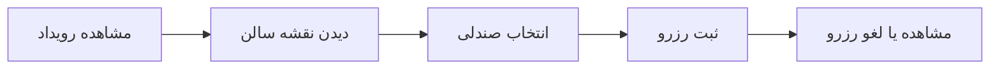
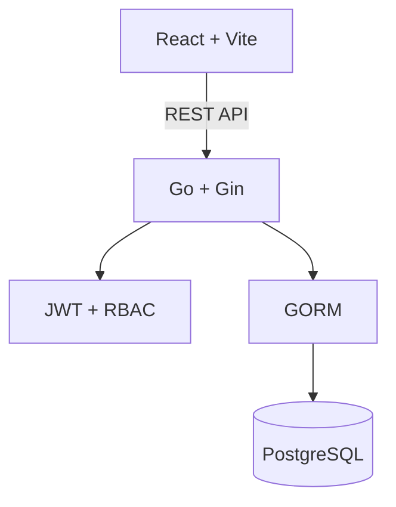

<div align="center">
  <h1>🎟️ سامانه هوشمند رزرو صندلی آمفی‌تئاتر</h1>

  <p dir="rtl">یک راه ساده، منظم و عادلانه برای مدیریت همایش‌ها و برنامه‌های اصلی دانشگاه</p>

  <p>
    
    
    
    
    <a href="https://github.com/sedwna/Ticket-reservation/releases/tag/v5.7.1"></a>
    <a href="https://github.com/sedwna/Ticket-reservation/actions/workflows/ci.yml"></a>
  </p>

  <p>
    <a href="#overview"><b>معرفی</b></a>
    · <a href="#features"><b>امکانات</b></a>
    · <a href="#quick-start"><b>شروع سریع</b></a>
    · <a href="#configuration"><b>پیکربندی</b></a>
    · <a href="#sample-data"><b>دیتاست آزمایشی</b></a>
  </p>
</div>

---

<a id="overview"></a>

## 🌱 این پروژه به چه درد می‌خورد؟

<p dir="rtl" align="right">
سلام بچه‌ها! این سامانه برای مدیریت همایش‌ها و برنامه‌های اصلی دانشگاه، مخصوصاً برنامه‌های آمفی‌تئاتر و سالن سرو طراحی شده؛ همان برنامه‌هایی که گاهی به‌خاطر شلوغی و بی‌نظمی، حق بعضی از دانشجوها ضایع می‌شود. دانشجو می‌تواند قبل از شروع برنامه، رویداد را ببیند و صندلی دلخواهش را آنلاین رزرو کند. به این ترتیب ورود و نشستن افراد منظم‌تر می‌شود، هرج‌ومرج کمتری پیش می‌آید و انجمن هم آمار دقیقی از شرکت‌کننده‌ها، صندلی‌ها و دانشجوهای فعال خواهد داشت.
</p>

<table dir="rtl">
  <tr>
    <td align="center" width="25%"><h3>⚖️ رزرو عادلانه</h3><p>هر دانشجو صندلی مشخص خودش را دارد؛ بدون صف و تصاحب سلیقه‌ای.</p></td>
    <td align="center" width="25%"><h3>💺 انتخاب تصویری</h3><p>وضعیت صندلی‌ها زنده نمایش داده می‌شود و انتخاب فقط با چند کلیک انجام می‌شود.</p></td>
    <td align="center" width="25%"><h3>🎭 مدیریت رویداد</h3><p>ساخت برنامه، چیدمان صندلی و کنترل ظرفیت از یک پنل واحد انجام می‌شود.</p></td>
    <td align="center" width="25%"><h3>📊 آمار قابل استفاده</h3><p>انجمن می‌تواند مشارکت، ظرفیت و روند رزروها را دقیق‌تر بررسی کند.</p></td>
  </tr>
</table>

## ✨ چرا این سامانه؟

<div dir="rtl" align="right">

- جلوگیری از شلوغی، صف‌های طولانی و بی‌نظمی پیش از شروع برنامه
- حفظ حق دانشجوها با اختصاص یک صندلی مشخص به هر رزرو
- مشخص شدن ظرفیت واقعی سالن و تعداد شرکت‌کننده‌ها پیش از اجرا
- شناسایی دانشجوهای فعال با تکیه بر داده‌های معتبر سامانه
- ساده‌تر شدن کار انجمن‌های علمی و فرهنگی در برنامه‌های پرتعداد
- دسترسی به گزارش‌ها، نمودارها و فایل خروجی برای برنامه‌ریزی‌های بعدی

</div>

## 🧭 تجربه استفاده



<p dir="rtl" align="center">
مدیر سامانه هم‌زمان می‌تواند ظرفیت سالن، رزروها، کاربران و گزارش هر رویداد را از پنل مدیریت کنترل کند.
</p>

<a id="features"></a>

## 🚀 امکانات

| بخش | قابلیت‌ها |
|:---:|:---|
| 👤 **دانشجو** | ثبت‌نام و ورود امن، مشاهده رویدادهای فعال، انتخاب صندلی از نقشه سالن، ثبت یا لغو رزرو و مشاهده سوابق |
| 🪑 **صندلی‌ها** | نمایش زنده وضعیت آزاد، رزروشده و رزروشده توسط خود کاربر؛ پشتیبانی از صندلی عادی و VIP |
| 🧑‍💼 **مدیر** | ساخت و ویرایش رویداد، تولید خودکار صندلی‌ها، مدیریت کاربران و نقش‌ها، فعال یا غیرفعال کردن حساب‌ها |
| 📈 **گزارش‌ها** | آمار کلی، روند هفتگی رزرو، میزان اشغال سالن، گزارش هر رویداد و خروجی CSV |
| 🔐 **امنیت** | JWT، سطح دسترسی مبتنی بر نقش، هش رمز عبور با bcrypt، کنترل هم‌زمانی رزرو و ثبت عملیات مدیر |
| 🌐 **تجربه کاربری** | رابط فارسی و راست‌چین، تاریخ شمسی، طراحی واکنش‌گرا و پیام‌های واضح |

## 🧱 فناوری و معماری

| لایه | فناوری | مسئولیت |
|---|---|---|
| رابط کاربری | React 19 · Vite 8 · Tailwind CSS · Recharts | صفحات دانشجو و مدیر، نقشه صندلی و نمودارها |
| API | Go 1.26 · Gin · GORM | منطق کسب‌وکار، اعتبارسنجی، احراز هویت و گزارش‌ها |
| داده | PostgreSQL 16 | کاربران، رویدادها، صندلی‌ها، رزروها و لاگ‌ها |
| اجرا | Docker Compose | ساخت و اجرای یکپارچه سرویس‌ها و بررسی سلامت |



<a id="quick-start"></a>

## ⚡ شروع سریع با Docker

<p dir="rtl" align="right">
برای اجرای کانتینری، Docker Engine به‌همراه Docker Compose لازم است. در Windows، اسکریپت زیر در اولین اجرا فایل محلی `.env` را با secretهای تصادفی می‌سازد و سپس سرویس‌ها را با health check بالا می‌آورد:
</p>

```powershell
.\build.ps1
```

در macOS و Linux ابتدا فایل محیط را بسازید، مقدارهای placeholder را با secretهای قوی جایگزین کنید و Compose را اجرا کنید:

```bash
cp .env.example .env
# .env را ویرایش کنید؛ DB_PASSWORD و JWT_SECRET نباید placeholder باقی بمانند.
docker compose up --detach --build --wait backend frontend
```

پس از آماده شدن سرویس‌ها:

| سرویس | نشانی |
|---|---|
| 🖥️ رابط کاربری | [http://localhost:3000](http://localhost:3000) |
| ❤️ سلامت بک‌اند | [http://localhost:8080/health](http://localhost:8080/health) |
| 🔌 نشانی پایه API | [http://localhost:8080/api/v1](http://localhost:8080/api/v1) |

> [!NOTE]
> نشانی اصلی پورت `8080` صفحه وب نیست؛ برای بررسی بک‌اند از مسیر `/health` و برای استفاده از سامانه از پورت `3000` استفاده کنید.

<a id="configuration"></a>

## ⚙️ پیکربندی محیط

فایل ریشهٔ [`.env.example`](./.env.example) مرجع اجرای Docker است. فایل [`backend/.env.example`](./backend/.env.example) برای اجرای مستقیم بک‌اند استفاده می‌شود. فایل‌های `.env` در Git نادیده گرفته می‌شوند و نباید حاوی مقدارهای واقعی در مخزن باشند.

| متغیر | الزام و کاربرد |
|---|---|
| `APP_ENV` | یکی از `development`، `test` یا `production` |
| `DB_PASSWORD` | اجباری و غیر-placeholder |
| `JWT_SECRET` | اجباری، غیر-placeholder و حداقل ۳۲ نویسه |
| `JWT_EXPIRY_HOURS` | عددی بین ۱ تا ۱۶۸؛ پیش‌فرض `24` |
| `CORS_ALLOWED_ORIGINS` | فهرست originهای کامل با جداکنندهٔ ویرگول؛ wildcard مجاز نیست |
| `EMAIL_DOMAIN_CHECK` | فعال‌سازی بررسی DNS دامنهٔ ایمیل؛ پیش‌فرض `true` |
| `DEMO_MODE` | پیش‌فرض `false` و در `production` ممنوع |
| `DEMO_ADMIN_*` | فقط هنگام فعال‌بودن حالت دمو؛ رمز باید حداقل ۱۲ نویسه باشد |
| `DEMO_DATA_PASSWORD` | فقط برای بارگذاری دیتاست آزمایشی لازم است |

> [!IMPORTANT]
> در محیط عملیاتی `APP_ENV=production`، originهای HTTPS واقعی و `DB_SSLMODE` مناسب ارائه‌دهندهٔ PostgreSQL را صریح تنظیم کنید. حالت دمو را فعال نکنید.

<a id="demo"></a>

## 🔑 حساب‌های دمو

حساب دمو به‌صورت پیش‌فرض ساخته نمی‌شود. برای محیط توسعه، `DEMO_MODE=true` را در فایل محلی `.env` قرار دهید و ایمیل، شماره دانشجویی و یک رمز قوی را با متغیرهای `DEMO_ADMIN_*` تعیین کنید. این حالت را در محیط عملیاتی فعال نکنید.

رمز همهٔ کاربران دیتاست آزمایشی نیز از `DEMO_DATA_PASSWORD` خوانده می‌شود و در کد، رابط کاربری یا مستندات ذخیره نشده است.

<a id="sample-data"></a>

## 🗃️ دیتاست کامل آزمایشی

<p dir="rtl" align="right">
برای اینکه همه بخش‌های سامانه—از داشبورد و نمودارها تا وضعیت‌های مختلف رویداد و رزرو—واقعاً قابل آزمایش باشند، یک دیتاست بزرگ و کنترل‌شده در پروژه قرار دارد.
</p>

| داده | تعداد و پوشش |
|---|---:|
| 👥 کاربران | **220** نفر: 50 مدیر، 120 کاربر فعال و 50 کاربر غیرفعال |
| 🎭 رویدادها | **200** رویداد: 50 فعال، 50 بسته، 50 تکمیل‌شده و 50 لغوشده |
| 💺 صندلی‌ها | **22,400** صندلی: 3,200 VIP و 19,200 عادی |
| 🎫 رزروها | **2,000** رزرو: 1,000 فعال، 500 تکمیل‌شده و 500 لغوشده |
| 🧾 گزارش عملیات | **250** لاگ: حداقل 50 مورد برای هر عملیات اصلی مدیر |

بارگذاری و اعتبارسنجی دیتاست:

```powershell
docker compose --profile seed run --rm full-data
```

<p dir="rtl" align="right">
فرایند ورود داده تراکنشی است؛ اگر تعداد رکوردها، ایمیل، شماره دانشجویی، وضعیت‌ها، تخصیص صندلی یا رزرو تکراری نامعتبر باشد، عملیات به‌صورت خودکار برگشت می‌خورد. اجرای دوباره این دستور هم امن است و فقط رکوردهای همین دیتاست را جایگزین می‌کند.
</p>

## ✅ قوانین اعتبارسنجی داده

| فیلد | قانون |
|---|---|
| ایمیل | قالب معتبر و دامنه دقیق `gmail.com` |
| شماره دانشجویی | فقط عدد و بین 10 تا 20 رقم |
| رمز عبور | حداقل 8 نویسه |
| مالکیت صندلی | هر صندلی در هر رویداد فقط یک رزرو فعال |
| حساب کاربری | نقش و وضعیت فعال/غیرفعال معتبر |

> بررسی قالب و دامنه ایمیل به‌تنهایی مالکیت واقعی صندوق ایمیل را ثابت نمی‌کند. برای محیط عملیاتی دانشگاه بهتر است تأیید ایمیل با کد یک‌بارمصرف و تطبیق شماره دانشجویی با مرجع رسمی دانشگاه اضافه شود.

<a id="manual-install"></a>

## 🧰 اجرای بدون Docker

<details dir="rtl">
  <summary><b>نمایش مراحل نصب دستی</b></summary>

### پیش‌نیازها

- Go 1.26 (مطابق `backend/go.mod`)
- Node.js 22 (نسخهٔ استفاده‌شده در Docker و CI)
- PostgreSQL 16 و یک دیتابیس با نام پیش‌فرض `ticket_reservation`

### بک‌اند

در PowerShell:

```powershell
cd backend
Copy-Item .env.example .env
# DB_PASSWORD و JWT_SECRET را در .env با مقدار واقعی جایگزین کنید.
go mod download
go run ./cmd/server
```

در Bash:

```bash
cd backend
cp .env.example .env
# DB_PASSWORD و JWT_SECRET را در .env با مقدار واقعی جایگزین کنید.
go mod download
go run ./cmd/server
```

### فرانت‌اند

```bash
cd frontend
npm ci
npm run dev
```

رابط توسعه روی [http://localhost:5173](http://localhost:5173) اجرا می‌شود و Vite درخواست‌های `/api` را به بک‌اند روی پورت `8080` هدایت می‌کند.

</details>

## 🔌 مسیرهای مهم API

<details dir="rtl">
  <summary><b>نمایش Endpointها</b></summary>

| بخش | متد | مسیر | دسترسی | کاربرد |
|---|:---:|---|:---:|---|
| عمومی | `GET` | `/health` | عمومی | سلامت بک‌اند |
| عمومی | `GET` | `/api/v1/public/stats` | عمومی | آمار عمومی سامانه |
| احراز هویت | `POST` | `/api/v1/auth/register` | عمومی | ثبت‌نام |
| احراز هویت | `POST` | `/api/v1/auth/login` | عمومی | ورود |
| رویداد | `GET` | `/api/v1/events` | کاربر | فهرست رویدادهای فعال |
| صندلی | `GET` | `/api/v1/events/:id/seats` | کاربر | نقشه صندلی‌های رویداد |
| رزرو | `POST` | `/api/v1/reservations` | کاربر | ثبت رزرو |
| رزرو | `GET` | `/api/v1/reservations/my` | کاربر | رزروهای کاربر |
| رزرو | `DELETE` | `/api/v1/reservations/:id` | کاربر | لغو رزرو |
| مدیریت | `GET` | `/api/v1/admin/users` | مدیر | مدیریت کاربران |
| گزارش | `GET` | `/api/v1/admin/reports/stats` | مدیر | آمار داشبورد |
| گزارش | `GET` | `/api/v1/admin/reports/export` | مدیر | خروجی CSV |

مسیرهای «کاربر» به header از نوع `Authorization: Bearer <token>` نیاز دارند. دسترسی مدیر علاوه بر توکن معتبر، در هر درخواست با وضعیت فعال و نقش فعلی کاربر در دیتابیس تطبیق داده می‌شود.

</details>

## 📁 ساختار پروژه

<details dir="rtl">
  <summary><b>نمایش درخت پوشه‌ها</b></summary>

```text
Ticket-reservation/
├── backend/
│   ├── cmd/server/              # نقطه شروع API
│   ├── config/                  # تنظیمات محیط
│   ├── internal/
│   │   ├── handlers/            # کنترل درخواست‌های HTTP
│   │   ├── services/            # منطق سامانه
│   │   ├── repository/          # دسترسی به داده
│   │   ├── models/              # مدل‌های پایگاه داده
│   │   └── middleware/          # احراز هویت و CORS
│   ├── migrations/              # مهاجرت‌های SQL
│   └── pkg/                     # ابزارهای مشترک
├── frontend/
│   └── src/
│       ├── components/          # اجزای قابل استفاده مجدد
│       ├── pages/               # صفحات کاربر و مدیر
│       ├── services/            # ارتباط با API
│       └── context/             # وضعیت سراسری برنامه
├── scripts/                     # اعتبارسنجی و دیتاست کامل
├── .github/workflows/           # CI و بررسی‌های خودکار
├── docker-compose.yml
└── README.md
```

</details>

## ✅ کنترل کیفیت

همان بررسی‌های اصلی CI را می‌توان پیش از ارسال تغییرات به‌صورت محلی اجرا کرد:

```bash
node scripts/verify-version.mjs
node scripts/validate_static_user_data.mjs
node scripts/validate_full_dataset.mjs

cd frontend
npm ci
npm run lint
npm run build
npm audit --audit-level=high

cd ../backend
go test -race ./...
go install golang.org/x/vuln/cmd/govulncheck@v1.6.0
govulncheck ./...
```

CI روی `main` فرانت‌اند را در Ubuntu و Windows آزمایش می‌کند و برای بک‌اند تست race، بررسی tidy بودن ماژول‌ها و `govulncheck` را اجرا می‌کند. وضعیت اجرای جاری در [GitHub Actions](https://github.com/sedwna/Ticket-reservation/actions/workflows/ci.yml) قابل مشاهده است.

## 🛡️ نکات فنی مهم

<div dir="rtl" align="right">

- قفل‌گذاری دیتابیس برای جلوگیری از رزرو هم‌زمان یک صندلی
- شناسه‌های UUID برای رکوردهای اصلی
- معماری لایه‌ای `Handler → Service → Repository → Database`
- ذخیره رمزهای عبور به‌صورت هش‌شده با bcrypt
- پذیرش JWT فقط با HS256، issuer معتبر و زمان انقضای اجباری
- بازاعتبارسنجی نقش و فعال‌بودن مدیر از دیتابیس در هر درخواست مدیریتی
- CORS مبتنی بر allowlist و بدون wildcard هنگام ارسال credential
- ثبت لاگ عملیات مهم مدیران
- بررسی خودکار سلامت سرویس‌ها در Docker Compose

</div>

---

<div align="center" dir="rtl">
  <h3>ساخته‌شده برای برنامه‌های منظم‌تر و فرصت برابرتر در دانشگاه 💙</h3>
  <p>اگر این پروژه برای انجمن یا دانشگاه شما مفید است، آن را توسعه دهید و با بقیه به اشتراک بگذارید.</p>
</div>
