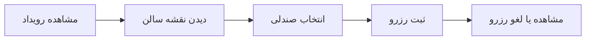
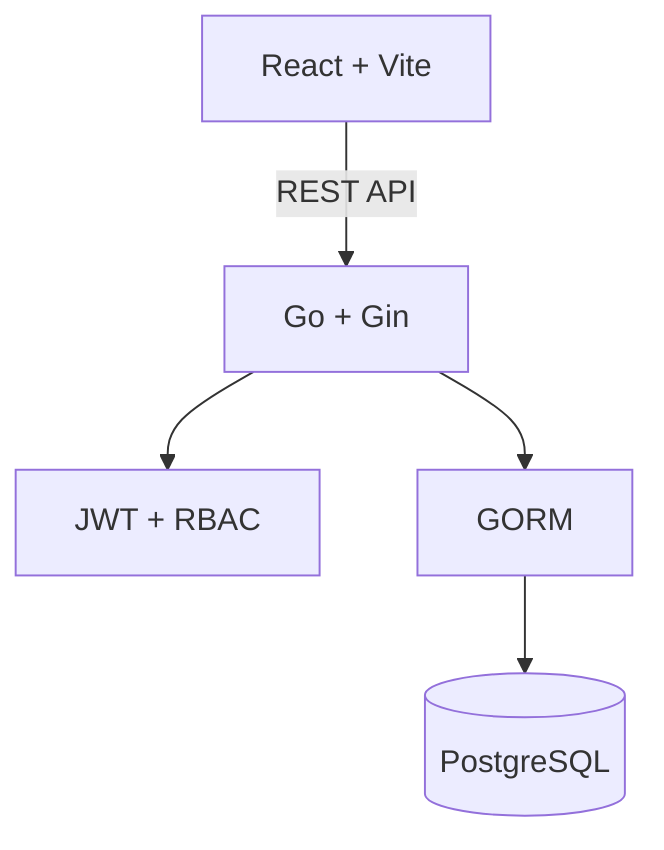

<div align="center">
  

  <h1>🎟️ سامانه هوشمند رزرو صندلی آمفی‌تئاتر</h1>

  <p dir="rtl">یک راه ساده، منظم و عادلانه برای مدیریت همایش‌ها و برنامه‌های اصلی دانشگاه</p>

  <p>
    
    
    
    
    
  </p>

  <p>
    <a href="#-چرا-این-سامانه"><b>چرا این سامانه؟</b></a>
    · <a href="#-امکانات"><b>امکانات</b></a>
    · <a href="#-شروع-سریع-با-docker"><b>شروع سریع</b></a>
    · <a href="#-حسابهای-آماده-دمو"><b>حساب‌های دمو</b></a>
    · <a href="#-دیتاست-کامل-آزمایشی"><b>دیتاست کامل</b></a>
  </p>
</div>

---

## 🌱 این پروژه به چه درد می‌خورد؟

<p dir="rtl" align="right">
سلام بچه‌ها! این سامانه برای مدیریت همایش‌ها و برنامه‌های اصلی دانشگاه، مخصوصاً برنامه‌های آمفی‌تئاتر و سالن سرو طراحی شده؛ همان برنامه‌هایی که گاهی به‌خاطر شلوغی و بی‌نظمی، حق بعضی از دانشجوها ضایع می‌شود. دانشجو می‌تواند قبل از شروع برنامه، رویداد را ببیند و صندلی دلخواهش را آنلاین رزرو کند. به این ترتیب ورود و نشستن افراد منظم‌تر می‌شود، هرج‌ومرج کمتری پیش می‌آید و انجمن هم آمار دقیقی از شرکت‌کننده‌ها، صندلی‌ها و دانشجوهای فعال خواهد داشت.
</p>

<table dir="rtl">
  <tr>
    <td align="center" width="25%"><h3>⚖️ رزرو عادلانه</h3><p>هر دانشجو صندلی مشخص خودش را دارد؛ بدون صف و تصاحب سلیقه‌ای.</p></td>
    <td align="center" width="25%"><h3>💺 انتخاب تصویری</h3><p>وضعیت صندلی‌ها زنده نمایش داده می‌شود و انتخاب فقط با چند کلیک انجام می‌شود.</p></td>
    <td align="center" width="25%"><h3>🎭 مدیریت رویداد</h3><p>ساخت برنامه، چیدمان صندلی و کنترل ظرفیت از یک پنل واحد انجام می‌شود.</p></td>
    <td align="center" width="25%"><h3>📊 آمار قابل استفاده</h3><p>انجمن می‌تواند مشارکت، ظرفیت و روند رزروها را دقیق‌تر بررسی کند.</p></td>
  </tr>
</table>

## ✨ چرا این سامانه؟

<div dir="rtl" align="right">

- جلوگیری از شلوغی، صف‌های طولانی و بی‌نظمی پیش از شروع برنامه
- حفظ حق دانشجوها با اختصاص یک صندلی مشخص به هر رزرو
- مشخص شدن ظرفیت واقعی سالن و تعداد شرکت‌کننده‌ها پیش از اجرا
- شناسایی دانشجوهای فعال با تکیه بر داده‌های معتبر سامانه
- ساده‌تر شدن کار انجمن‌های علمی و فرهنگی در برنامه‌های پرتعداد
- دسترسی به گزارش‌ها، نمودارها و فایل خروجی برای برنامه‌ریزی‌های بعدی

</div>

## 🧭 تجربه استفاده



<p dir="rtl" align="center">
مدیر سامانه هم‌زمان می‌تواند ظرفیت سالن، رزروها، کاربران و گزارش هر رویداد را از پنل مدیریت کنترل کند.
</p>

## 🚀 امکانات

| بخش | قابلیت‌ها |
|:---:|:---|
| 👤 **دانشجو** | ثبت‌نام و ورود امن، مشاهده رویدادهای فعال، انتخاب صندلی از نقشه سالن، ثبت یا لغو رزرو و مشاهده سوابق |
| 🪑 **صندلی‌ها** | نمایش زنده وضعیت آزاد، رزروشده و رزروشده توسط خود کاربر؛ پشتیبانی از صندلی عادی و VIP |
| 🧑‍💼 **مدیر** | ساخت و ویرایش رویداد، تولید خودکار صندلی‌ها، مدیریت کاربران و نقش‌ها، فعال یا غیرفعال کردن حساب‌ها |
| 📈 **گزارش‌ها** | آمار کلی، روند هفتگی رزرو، میزان اشغال سالن، گزارش هر رویداد و خروجی CSV |
| 🔐 **امنیت** | JWT، سطح دسترسی مبتنی بر نقش، رمزنگاری رمز عبور، کنترل هم‌زمانی رزرو و ثبت عملیات مدیر |
| 🌐 **تجربه کاربری** | رابط فارسی و راست‌چین، تاریخ شمسی، طراحی واکنش‌گرا و پیام‌های واضح |

## 🧱 فناوری و معماری

| لایه | فناوری | مسئولیت |
|---|---|---|
| رابط کاربری | React 19 · Vite 8 · Tailwind CSS · Recharts | صفحات دانشجو و مدیر، نقشه صندلی و نمودارها |
| API | Go 1.21 · Gin · GORM | منطق کسب‌وکار، اعتبارسنجی، احراز هویت و گزارش‌ها |
| داده | PostgreSQL 16 | کاربران، رویدادها، صندلی‌ها، رزروها و لاگ‌ها |
| اجرا | Docker Compose | ساخت و اجرای یکپارچه سرویس‌ها و بررسی سلامت |



## ⚡ شروع سریع با Docker

<p dir="rtl" align="right">
برای اجرای پروژه فقط Docker Desktop لازم است. دستور زیر دیتابیس، بک‌اند و فرانت‌اند را می‌سازد و سرویس‌ها را با بررسی سلامت بالا می‌آورد:
</p>

```powershell
docker compose up -d --build --force-recreate backend frontend
```

پس از آماده شدن سرویس‌ها:

| سرویس | نشانی |
|---|---|
| 🖥️ رابط کاربری | [http://localhost:3000](http://localhost:3000) |
| ❤️ سلامت بک‌اند | [http://localhost:8080/health](http://localhost:8080/health) |
| 🔌 نشانی پایه API | [http://localhost:8080/api/v1](http://localhost:8080/api/v1) |

> [!NOTE]
> نشانی اصلی پورت `8080` صفحه وب نیست؛ برای بررسی بک‌اند از مسیر `/health` و برای استفاده از سامانه از پورت `3000` استفاده کنید.

## 🔑 حساب‌های آماده دمو

<table dir="rtl">
  <thead>
    <tr><th>کاربرد</th><th>ایمیل</th><th>شماره دانشجویی</th><th>رمز عبور</th><th>زمان دسترسی</th></tr>
  </thead>
  <tbody>
    <tr><td>مدیر اصلی سامانه</td><td><code>ticket.reservation.demo+system-admin@gmail.com</code></td><td><code>4000000001</code></td><td><code>REMOVED_SECRET</code></td><td>همیشه پس از اجرای برنامه</td></tr>
    <tr><td>مدیر دیتاست</td><td><code>ticket.reservation.demo+full.user001@gmail.com</code></td><td><code>4100000001</code></td><td><code>REMOVED_SECRET</code></td><td>پس از بارگذاری دیتاست کامل</td></tr>
    <tr><td>دانشجوی فعال</td><td><code>ticket.reservation.demo+full.user051@gmail.com</code></td><td><code>4100000051</code></td><td><code>REMOVED_SECRET</code></td><td>پس از بارگذاری دیتاست کامل</td></tr>
  </tbody>
</table>

> [!IMPORTANT]
> همه این حساب‌ها آزمایشی هستند. اطلاعات دیتاست ساختگی اما معتبر است و به افراد واقعی تعلق ندارد.

## 🗃️ دیتاست کامل آزمایشی

<p dir="rtl" align="right">
برای اینکه همه بخش‌های سامانه—از داشبورد و نمودارها تا وضعیت‌های مختلف رویداد و رزرو—واقعاً قابل آزمایش باشند، یک دیتاست بزرگ و کنترل‌شده در پروژه قرار دارد.
</p>

| داده | تعداد و پوشش |
|---|---:|
| 👥 کاربران | **220** نفر: 50 مدیر، 120 کاربر فعال و 50 کاربر غیرفعال |
| 🎭 رویدادها | **200** رویداد: 50 فعال، 50 بسته، 50 تکمیل‌شده و 50 لغوشده |
| 💺 صندلی‌ها | **22,400** صندلی: 3,200 VIP و 19,200 عادی |
| 🎫 رزروها | **2,000** رزرو: 1,000 فعال، 500 تکمیل‌شده و 500 لغوشده |
| 🧾 گزارش عملیات | **250** لاگ: حداقل 50 مورد برای هر عملیات اصلی مدیر |

بارگذاری و اعتبارسنجی دیتاست:

```powershell
docker compose --profile seed run --rm full-data
```

<p dir="rtl" align="right">
فرایند ورود داده تراکنشی است؛ اگر تعداد رکوردها، ایمیل، شماره دانشجویی، وضعیت‌ها، تخصیص صندلی یا رزرو تکراری نامعتبر باشد، عملیات به‌صورت خودکار برگشت می‌خورد. اجرای دوباره این دستور هم امن است و فقط رکوردهای همین دیتاست را جایگزین می‌کند.
</p>

## ✅ قوانین اعتبارسنجی داده

| فیلد | قانون |
|---|---|
| ایمیل | قالب معتبر و دامنه دقیق `gmail.com` |
| شماره دانشجویی | فقط عدد و بین 10 تا 20 رقم |
| رمز عبور | حداقل 8 نویسه |
| مالکیت صندلی | هر صندلی در هر رویداد فقط یک رزرو فعال |
| حساب کاربری | نقش و وضعیت فعال/غیرفعال معتبر |

> بررسی قالب و دامنه ایمیل به‌تنهایی مالکیت واقعی صندوق ایمیل را ثابت نمی‌کند. برای محیط عملیاتی دانشگاه بهتر است تأیید ایمیل با کد یک‌بارمصرف و تطبیق شماره دانشجویی با مرجع رسمی دانشگاه اضافه شود.

## 🧰 اجرای بدون Docker

<details dir="rtl">
  <summary><b>نمایش مراحل نصب دستی</b></summary>

### پیش‌نیازها

- Go 1.21 یا بالاتر
- Node.js 20 یا بالاتر
- PostgreSQL 16

### بک‌اند

```bash
cd backend
cp .env.example .env
go mod tidy
go run cmd/server/main.go
```

### فرانت‌اند

```bash
cd frontend
npm install
npm run dev
```

</details>

## 🔌 مسیرهای مهم API

<details dir="rtl">
  <summary><b>نمایش Endpointها</b></summary>

| بخش | متد | مسیر | کاربرد |
|---|:---:|---|---|
| احراز هویت | `POST` | `/api/v1/auth/register` | ثبت‌نام |
| احراز هویت | `POST` | `/api/v1/auth/login` | ورود |
| رویداد | `GET` | `/api/v1/events` | فهرست رویدادهای فعال |
| صندلی | `GET` | `/api/v1/events/:id/seats` | نقشه صندلی‌های رویداد |
| رزرو | `POST` | `/api/v1/reservations` | ثبت رزرو |
| رزرو | `GET` | `/api/v1/reservations/my` | رزروهای کاربر |
| رزرو | `DELETE` | `/api/v1/reservations/:id` | لغو رزرو |
| مدیریت | `GET` | `/api/v1/admin/users` | مدیریت کاربران |
| گزارش | `GET` | `/api/v1/admin/reports/stats` | آمار داشبورد |
| گزارش | `GET` | `/api/v1/admin/reports/export` | خروجی CSV |

</details>

## 📁 ساختار پروژه

<details dir="rtl">
  <summary><b>نمایش درخت پوشه‌ها</b></summary>

```text
Ticket-reservation/
├── backend/
│   ├── cmd/server/              # نقطه شروع API
│   ├── config/                  # تنظیمات محیط
│   ├── internal/
│   │   ├── handlers/            # کنترل درخواست‌های HTTP
│   │   ├── services/            # منطق سامانه
│   │   ├── repository/          # دسترسی به داده
│   │   ├── models/              # مدل‌های پایگاه داده
│   │   └── middleware/          # احراز هویت و CORS
│   ├── migrations/              # مهاجرت‌های SQL
│   └── pkg/                     # ابزارهای مشترک
├── frontend/
│   └── src/
│       ├── components/          # اجزای قابل استفاده مجدد
│       ├── pages/               # صفحات کاربر و مدیر
│       ├── services/            # ارتباط با API
│       └── context/             # وضعیت سراسری برنامه
├── scripts/                     # اعتبارسنجی و دیتاست کامل
├── docs/                        # فایل‌های تصویری مستندات
├── docker-compose.yml
└── README.md
```

</details>

## 🛡️ نکات فنی مهم

<div dir="rtl" align="right">

- قفل‌گذاری دیتابیس برای جلوگیری از رزرو هم‌زمان یک صندلی
- شناسه‌های UUID برای رکوردهای اصلی
- معماری لایه‌ای `Handler → Service → Repository → Database`
- ذخیره رمزهای عبور به‌صورت هش‌شده با bcrypt
- توکن JWT و کنترل دسترسی بر اساس نقش کاربر
- ثبت لاگ عملیات مهم مدیران
- بررسی خودکار سلامت سرویس‌ها در Docker Compose

</div>

---

<div align="center" dir="rtl">
  <h3>ساخته‌شده برای برنامه‌های منظم‌تر و فرصت برابرتر در دانشگاه 💙</h3>
  <p>اگر این پروژه برای انجمن یا دانشگاه شما مفید است، آن را توسعه دهید و با بقیه به اشتراک بگذارید.</p>
</div>
